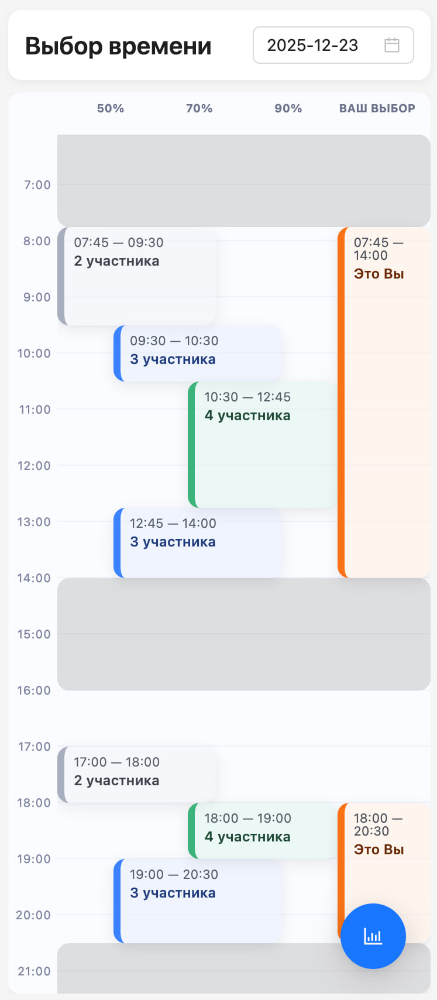
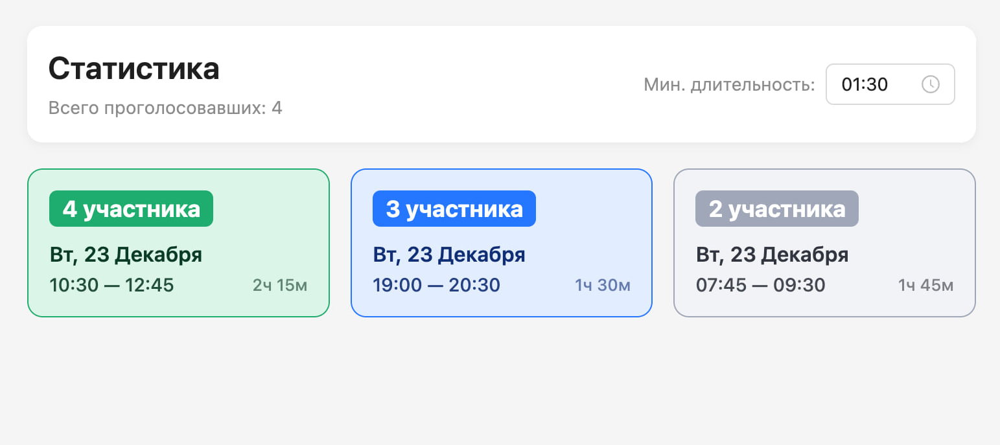

# MeetGrid Frontend

[MeetGrid](https://meetgrid-frontend-deploy.vercel.app/) — это удобная платформа для координации времени групповых встреч. Приложение решает проблему бесконечных переписок и негибких опросов в мессенджерах, позволяя участникам визуально выбрать удобные интервалы во времени на календаре, а организатору — моментально увидеть лучшие пересечения.

Сравните, насколько более наглядным становится процесс выбора времени встречи! Layout для десктопа можно найти в папке `ui/`. Я подготовил [топик-демонастрацию](https://meetgrid-frontend-deploy.vercel.app/topic/pddZxUtK) – там уже проголосовало несколько человек, можете зайти в этот топик и посмотреть на работу приложения в действии!




## Описание функционала

Условно, экран календаря делится на 2 секции: это статистика (тепловая карта, я ее называю лестницей), она находится слева, и поле выбора для пользователя – самая правая колонка.  

Статистика устроена следующим образом: приложение подсчитывает общее число голосов, рассматривает все возможные интервалы времени и строит тепловую карту относительно количества человек, которые могут посетить мероприятие в заданные промежутки времени. 

На карточке подписано сколько человек и в какое время смогут присутствовать. Также есть экран сводки (перейти можно по кнопке справа снизу). Там доступны фильтры по минимальному времени слота – чтобы ещё удобнее подобрать удобное всем время.

## Основной сценарий использования

1.  **Создание опроса**:
    *   Откройте главную страницу и нажмите "Создать опрос".
    *   Введите название встречи, имя организатора.
    *   Настройте временные ограничения (диапазон дат и времени). Это необязательно, тогда будет доступно любое время для голосования. Советую выбрать по 1-2 интервала в двух днях недели.
    *   Нажмите "Создать" и скопируйте ссылку-приглашение. Или можете сразу перейти по ней, а потом скопировать ссылку из адресной строки.

2.  **Голосование**:
    *   Перейдите по ссылке-приглашению.
    *   Введите свое имя. (Если Вы только что создали топик, Вас автоматически авторизует)
    *   На календаре выделите (продолжительным кликом и протягиванием вниз на мобильном устройстве) удобные вам интервалы времени в самой правой колонке. Чтобы поменять границы или удалить интервал – нажмите на него, откроется меню. А десктопа поддерживается нативный drag-and-drop.
    *   Ваши голоса сохраняются автоматически.
    *   В идеале – позвать Ваших друзей и использовать приложение по назначению – тогда можно получить результат, похожий на демки в папке `/ui` в корне проекта (или перейти по ссылке на [демо-топик](https://meetgrid-frontend-deploy.vercel.app/topic/pddZxUtK))

3.  **Анализ результатов**:
    *   Организатор (и любой участник) видит тепловую карту: чем насыщеннее цвет слота, тем больше участников могут прийти в это время.
    *   Используйте переключатель "Статистика" для просмотра топа лучших интервалов списком и фильтрации недостаточно длинных промежутков.

## Quickstart

Для запуска проекта локально,   нужно выполнить несколько шагов:

### 1. Склонировать репозитории

```bash
mkdir meet-grid && cd meet-grid
git clone https://github.com/v1adls1av/meetgrid-frontend.git frontend
git clone https://github.com/v1adls1av/meetgrid-backend.git backend
```

### 2. Запустить оба проекта

#### Frontend

```bash
cd frontend
cp .env.example .env
npm install
npm run dev
cd ..
```

#### Backend

```bash
cd backend
cp .env.example .env
docker compose up
cd ..
```

### 3. Перейти на [http://localhost:5173](http://localhost:5173)

## Development Guide

### Как получить исходники

```bash
git clone https://github.com/v1adls1av/meetgrid-frontend.git
cd meetgrid-frontend
```

### Требования

Для запуска и разработки Вам понадобятся:

*   **Node.js**: версия 18 LTS.
*   **npm**: версия 9+ или совместимый пакетный менеджер (yarn/ui/pnpm).
*   **Backend**: Запущенный экземпляр MeetGrid Backend (FastAPI + Redis).
    *   Инструкции по запуску бэкенда находятся в репозитории [meetgrid-backend](https://github.com/v1adls1av/meetgrid-backend).
    *   Либо наличие URL публичного API.

Для локальной разработки бэкенда рекомендуется Docker. (Для запуска Redis)

### Запуск проекта

#### 1. Установка зависимостей

Перейдите в папку проекта и установите пакеты:

```bash
cd meetgrid-frontend
npm install
```

#### 2. Настройка окружения

Создайте файл `.env` на основе примера:

```bash
cp .env.example .env
```

Отредактируйте `.env` и укажите актуальный URL API:

```env
VITE_API_BASE_URL="http://localhost:8000/api/v1/topic"
```
*Если запускаете локально – можете оставить этот адрес. Бэкенд по умолчанию поднимается на нём.*

#### 3. Запуск приложения

Запустите сервер:

```bash
npm run dev
```

Приложение будет доступно по адресу: [http://localhost:5173](http://localhost:5173)

#### Дополнительные команды

*   `npm run build` — сборка проекта для продакшена.
*   `npm run test` — запуск юнит-тестов (Jest).
*   `npm run cypress:open` — открытие Cypress для E2E тестов.

## Структура приложения

*   `src/components` — переиспользуемые React-компоненты (календарь, модальные окна, кнопки).
*   `src/pages` — основные страницы приложения:
    *   `LandingPage` — приветственный экран.
    *   `TopicCreatePage` — форма создания новой встречи.
    *   `TopicMainPage` — основная страница голосования и результатов.
*   `src/routes` — конфигурация маршрутизации (React Router).
*   `src/store` — управление состоянием (Redux Toolkit): слайсы топиков и пользователей.
*   `src/services` — взаимодействие с API (axios).
*   `src/utils` — вспомогательные функции для работы с датами и календарем.
*   `src/assets` — статические файлы (стили, изображения).
